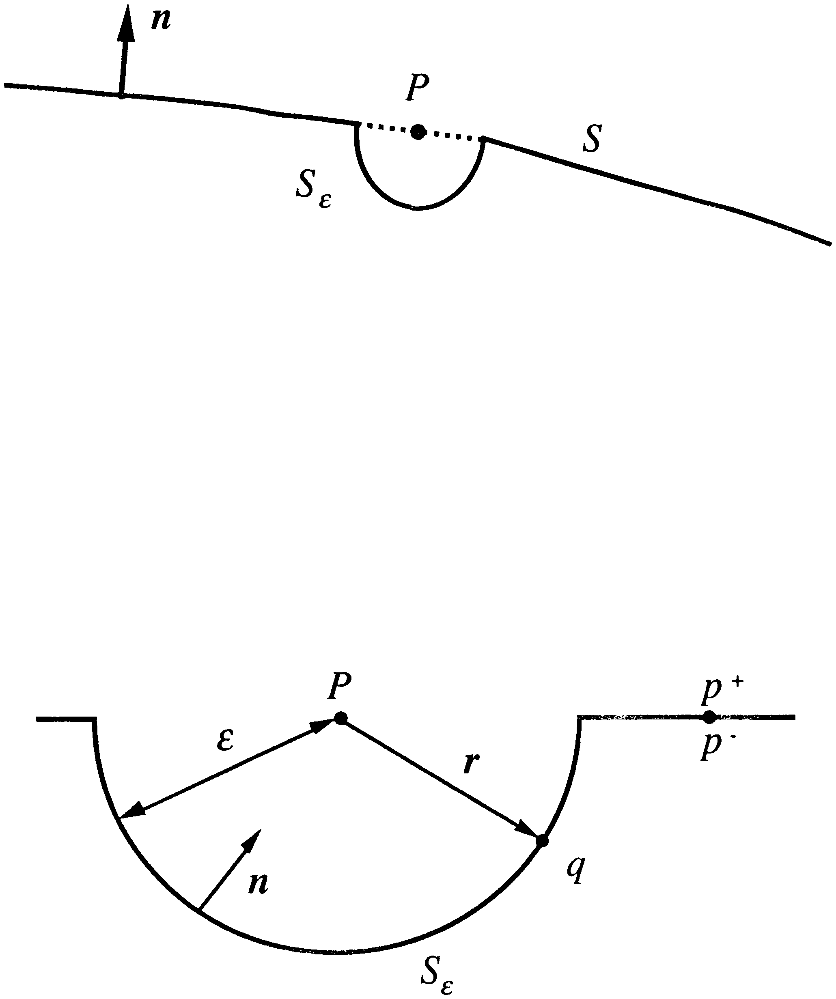

### 2.2.2 Discontinuities 

The integral operators that are of interest are defined by:

$$
\mathcal{L}_k[\phi](P) = \int_S G_k(P, Q) \phi(Q) dS_q, \tag{2.2.3}
$$

$$
\mathcal{M}_k[\phi](P) = \int_S \frac{\partial G_k(P, Q)}{\partial n_q} \phi(Q) dS_q, \tag{2.2.4}
$$

$$
\mathcal{M}^T_k[\phi](P) = \int_S \frac{\partial G_k(P, Q)}{\partial n_p} \phi(Q) dS_q, \tag{2.2.5}
$$

$$
\mathcal{N}_k[\phi](P) = \int_S \frac{\partial^2 G_k(P, Q)}{\partial n_q \partial n_p} \phi(Q) dS_q. \tag{2.2.6}
$$

The function $\phi$ is assumed to be a continuous function over $S$. For completeness there is also the identity operator,

$$
\mathcal{I}[\phi](P) = \phi(P). \tag{2.2.7}
$$

An important property of these operators defined in Eq. (2.2.3-6) is that they are all solutions of the original acoustic differential equation. Each can be thought of as the result of a continuous distribution of sources, magnitude $\phi(Q)$, over the surface of $S$.

It is useful to establish the behaviour of these integral operators as the field point $P$ is brought to the surface $S$. The limit of a field point brought to the surface in the direction opposite to the direction of the surface normal will be denoted by $P^+$, the limit of the field point brought to the surface in the same direction as the surface normal will be denoted by $P^-$. 

In general points on a surface will be denoted by lower case symbols. Firstly construct a small sphere of small radius $\epsilon$ centered around the surface limit point. The domain of integration is taken to be the surface $S$, excluding the small sphere, and that part of the small sphere, $S_\epsilon$, that completes the surface. The radius $\epsilon$ is then taken to zero to evaluate the limiting value of the integral operator. [Figure 2.1](#figure-2-1) illustrates the geometry for evaluating the limit of $P \rightarrow P^+$.

Consider the integral operator $\mathcal{L}_k$.

$$
\lim_{P \rightarrow P^+} \mathcal{L}_k[\phi](P) = \lim_{\epsilon \rightarrow 0} \left[ \int_{S-S_\epsilon} G_k(p, q) \phi(q) dS_q + \int_{S_\epsilon} \frac{\epsilon^2}{4 \pi \epsilon} \sin(\theta) d\theta d\phi \right]. \tag{2.2.8}
$$

The polar angles $\theta$ and $\phi$ define the surface $S_\epsilon$. For Eq. (2.2.8) the second term on the right-hand side goes to zero in the limit and so the operator $\mathcal{L}_k$ is continuous across the surface $S$.

Consider the same limiting process for the $\mathcal{M}_k$ operator,

$$
\lim_{P \rightarrow P^+} \mathcal{M}_k[\phi](P) = \lim_{\epsilon \rightarrow 0} \left[ \int_{S-S_\epsilon} \frac{\partial G_k(P, Q)}{\partial n_q} \phi(Q) dS_q + \int_{S_\epsilon} \frac{-n_q \cdot \hat{r}}{4 \pi \epsilon^2} \sin(\theta) d\theta d\phi \right]. \tag{2.2.9}
$$

In Eq. (2.2.9) the vector $\hat{r}$ is the unit vector pointing from $P$ to $P^+$. This time the second term on the right hand side tends towards a limiting value and so,

$$
\lim_{P \rightarrow P^+} \mathcal{M}_k[\phi](P) = \mathcal{M}_k[\phi](P) + (1 - c(p)) \phi(p). \tag{2.2.10}
$$

The quantity $4 \pi c(p)$ is the external solid angle at the point $p$. For a smooth surface; i.e., one that has a unique tangent plane, then

$$
c(p) = \frac{1}{2}. \tag{2.2.11}
$$

A definition of $c(p)$ can be gained by considering the limit,

$$
\lim_{P \rightarrow P^+} \left[ \mathcal{M}_k[\phi](P) - c(P) \int_S \frac{\partial G_0(P, Q)}{\partial n_q} dS_q \right]. \tag{2.2.12}
$$

This equation is continuous as $P$ passes through the surface $S$. Noting the discontinuity in the $\mathcal{M}_k$ operator, indicates a mathematical definition for the quantity $c(p)$,

$$
c(p) = 1 + \int_S \frac{\partial G_0(p, q)}{\partial n_q} dS_q. \tag{2.2.13}
$$

Using the arguments described above, it is possible to evaluate the discontinuity properties of all the integral equations and these are summarized below,

$$
\mathcal{L}_k[\phi](p^+) = \mathcal{L}_k[\phi](p) = \mathcal{L}_k[\phi](p^-), \tag{2.2.14}
$$

$$
\mathcal{M}_k[\phi](p^+) - (1 - c(p)) \phi(p) = \mathcal{M}_k[\phi](p) = \mathcal{M}_k[\phi](p^-) + c(p) \phi(p), \tag{2.2.15}
$$

$$
\mathcal{M}^T_k[\phi](p^+) + (1 - c(p)) \phi(p) = \mathcal{M}^T_k[\phi](p) = \mathcal{M}^T_k[\phi](p^-) - c(p) \phi(p), \tag{2.2.16}
$$

$$
\mathcal{N}_k[\phi](p^+) = \mathcal{N}_k[\phi](p) = \mathcal{N}_k[\phi](p^-), \tag{2.2.17}
$$

It is important to realize that $\mathcal{M}_k[\phi](p^+)$ represents the limiting value of $\mathcal{M}_k[\phi](P)$ as $P$ tends to $p^+$, whilst $\mathcal{M}_k[\phi](p)$ represents the principal value of the integral operation; that is the limit value of an integration over a surface $S - S_\epsilon$, as $\epsilon$ goes to zero.

<picture>
  <source media="(prefers-color-scheme: dark)" srcset="assets/figure-2-1-dark.png">
  <source media="(prefers-color-scheme: light)" srcset="assets/figure-2-1.png">
  
</picture>
Figure 2.1. Geometry for evaluating the discontinuity of the integral operators.