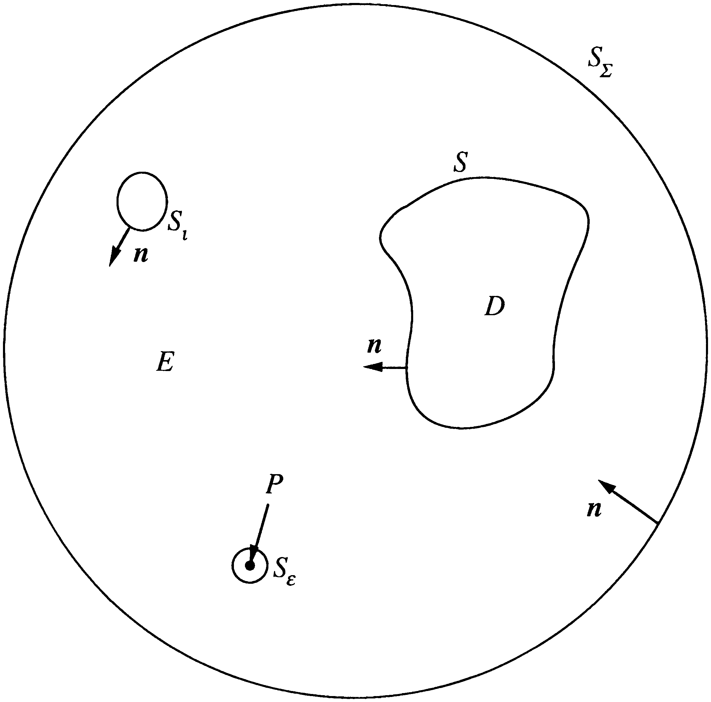

### 2.3.1 Surface Helmholtz Integral Equation 

The Surface Helmholtz' Integral equation (SHIE) forms the basis of most boundary element methods (BEM). This equation can be derived by considering the general acoustic geometry shown in [Figure 2.2](#figure-2-2). A spherical surface, $S_E$, contains two closed surfaces $S_i$ and $S$. The surface $S$ represents the acoustic surface of interest and the surface $S_i$ represents the surface of some acoustic source. The domain $E$ is the volume contained by $S_E$ excluding the volume contained by $S_i$ and $S$. The domain $D$ represents the volume contained by the surface $S$. A small spherical surface $S_\epsilon$ surrounds the field point $P$.

With the surface $S_\epsilon$ excluding the singular point $P$ from the domain $E$, both the Green’s free space function and the velocity potential in $E$ satisfy the reduced wave equation and so,

$$
\int_E \left( \phi(Q) \nabla^2 G_k(P, Q) - G_k(P, Q) \nabla^2 \phi(Q) \right) dV_Q = 0. \tag{2.3.1}
$$

By using Green’s formula, this volume integral may be converted to a combination of surface integrals over the surfaces bounding $E$,

$$
I_S(P) + I_{S_i}(P) + I_{S_\epsilon}(P) = 0, \tag{2.3.2}
$$

where the integrals $I(P)$ are of the form,

$$
I_S(P) = \int_{S} \left( \phi(q) \frac{\partial G_k(P, q)}{\partial n_q} - \frac{\partial \phi(q)}{\partial n_q} G_k(P, q) \right) dS_q. \tag{2.3.3}
$$

The negative sign reflects the fact that the normals are defined to point into the domain $E$.

The SHIE for an infinite exterior domain is obtained when the radius of the surface $S_E$ is taken to infinity and the radius of $S_\epsilon$ is taken to zero. By the Sommerfeld radiation condition $I_{S_\epsilon}$ will tend to zero. The integral $I_{S_i}$ has different values depending on the position of the field point $P$. For $P \in D$ its value must be zero since $I_{S_i}$ is no longer a bounding surface of $E$. For $P$ on $S$ or in $E$, its value can be evaluated in a similar way to the limiting procedures of section (1.2.2). The value of this integral as in the limit is given by,

$$
I_{S_\epsilon}(P) = 
\begin{cases} 
\phi(P) & P \in E \\
c(P)\phi(P) & P \in S \\
0 & P \in D 
\end{cases}. \tag{2.3.4}
$$

The integral $I_S$, may now be seen to be equivalent to the velocity potential that would exist in the absence of the surface $S$,

$$
I_S(P) = \phi_i(P). \tag{2.3.5}
$$

The SHIE for the infinite exterior domain can now be written as,

$$
\int_{S} \left( \phi(q) \frac{\partial G_k(P, q)}{\partial n_q} - \frac{\partial \phi(q)}{\partial n_q} G_k(P, q) \right) dS_q + \phi_i(P) = 
\begin{cases} 
\phi(P) & P \in E \\
c(P)\phi(P) & P \in S \\
0 & P \in D 
\end{cases}. \tag{2.3.6}
$$

Using a similar argument the SHIE for the interior problem can be derived:

$$
\int_{S} \left( \phi(q) \frac{\partial G_k(P, q)}{\partial n_q} - \frac{\partial \phi(q)}{\partial n_q} G_k(P, q) \right) dS_q = 
\begin{cases} 
0 & P \in E \\
-(1 - c(P))\phi(P) & P \in S \\
- \phi(P) & P \in D 
\end{cases}. \tag{2.3.7}
$$

In terms of integral operator notation the boundary integral equations on the surface $S$ are given by,

Exterior:

$$
L_k \frac{\partial \phi}{\partial n} - \phi_i = [-c(p)I + M_k] \phi, \tag{2.3.8}
$$

Interior:

$$
L_k \frac{\partial \phi}{\partial n} = [(1 - c(p))I + M_k] o. \tag{2.3.9}
$$

<picture>
  <source media="(prefers-color-scheme: dark)" srcset="assets/figure-2-2-dark.png">
  <source media="(prefers-color-scheme: light)" srcset="assets/figure-2-2.png">
  
</picture>
Figure 2.2. Geometry for deriving the surface Helmholtz' integral equations.