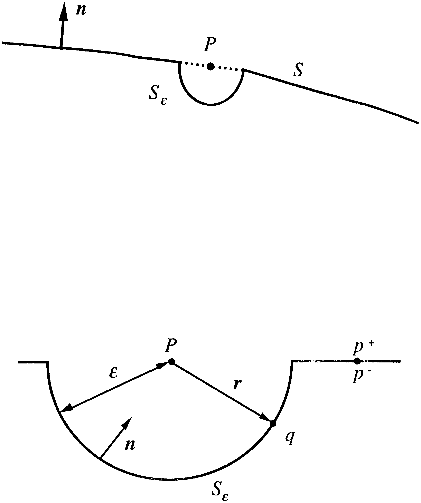
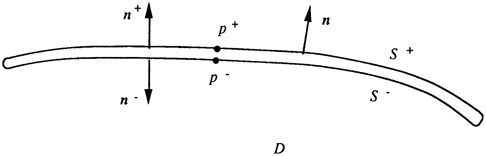

# 2 CHAPTER 2. Acoustic Problem 

## 2.1 Fundamental Equations 

The analysis of any acoustic problem involves the solution of a differential equation relating fluid variables in the medium of interest, subject to certain boundary conditions. This work is primarily concerned with the interaction of acoustic radiation with submerged structures and the appropriate differential equation is the linear wave equation subject to a velocity boundary condition on the submerged structure.

### 2.1.1 Linear Approximation 

In a fundamental analysis [Pierce (1989)](#bib-pierce-1989) of the acoustic pressure field, the linear wave equation is developed from a consideration of mass and energy conservation. This analysis assumes that the acoustic pressure field is a small amplitude perturbation to the ambient state, characterized by those values that pressure, density, and fluid velocity have when the perturbation is absent. The fluid or acoustic medium is assumed to be homogeneous and quiescent; i.e. the ambient quantities are assumed to be independent of position and time with the ambient fluid velocity equal to zero.

Consider a body of fluid in a volume $V$, with density $\rho$, surrounded by a surface $S$. The fluid velocity at a point $P$ is given by $v(P)$ and the outward normal to the surface $S$ is defined by $\mathbf{n}$. Conservation of mass requires that the net mass leaving $V$ per unit time is equal to the rate at which mass decreases in $V$. This is expressed by the relationship:

$$- \frac{d}{dt} \int_V \rho \; dV = \int_S \rho v \cdot \mathbf{n} \; dS. \tag{2.1.1}$$

The right-hand side of this equation can be transformed to a volume integral by means of Gauss' theorem and Euler's differential equation for conservation of mass is obtained:

$$\frac{\partial \rho}{\partial t} + \nabla \cdot (\rho \mathbf{v}) = 0. \tag{2.1.2}$$

The pressure field at a point $P$ is given by $p(P)$. By considering the forces acting on the fluid, and neglecting body forces and viscosity, the fluid velocity and pressure are related by,

### 2.1.1 Linear Approximation 

In a fundamental analysis [Pierce (1989)](#bib-pierce-1989) of the acoustic pressure field, the linear wave equation is developed from a consideration of mass and energy conservation. This analysis assumes that the acoustic pressure field is a small amplitude perturbation to the ambient state, characterized by those values that pressure, density, and fluid velocity have when the perturbation is absent. The fluid or acoustic medium is assumed to be homogeneous and quiescent; i.e., the ambient quantities are assumed to be independent of position and time with the ambient fluid velocity equal to zero.

Consider a body of fluid in a volume $V$, with density $\rho$, surrounded by a surface $S$. The fluid velocity at a point $P$ is given by $v(P)$ and the outward normal to the surface $S$ is defined by $\mathbf{n}$. Conservation of mass requires that the net mass leaving $V$ per unit time is equal to the rate at which mass decreases in $V$. This is expressed by the relationship,

$$- \frac{d}{dt} \int_V \rho \, dV = \int_S \rho v \cdot \mathbf{n} \, dS. \tag{2.1.1}$$

The right-hand side of this equation can be transformed to a volume integral by means of Gauss' theorem and Euler's differential equation for conservation of mass is obtained,

$$\frac{\partial \rho}{\partial t} + \nabla \cdot (\rho v) = 0. \tag{2.1.2}$$

The pressure field at a point $P$ is given by $p(P)$. By considering the forces acting on the fluid, and neglecting body forces and viscosity, the fluid velocity and pressure are related by,

$$\rho \left( \frac{\partial v}{\partial t} + (v \cdot \nabla)v \right) = -\nabla p. \tag{2.1.3}$$

This equation represents an example of Reynolds' transport theorem.

The relationship between the pressure field and density in the fluid is obtained by making the assumption that the acoustic radiation is adiabatic in the linear approximation. Consequently, it is possible to write,

$$\frac{\partial p}{\partial t} = c^2 \frac{\partial \rho}{\partial t}, \quad c^2 = \left( \frac{\partial p}{\partial \rho} \right)_s. \tag{2.1.4}$$

The real constant $c$ is referred to as the speed of sound in the particular fluid medium and the subscript $s$ in Eq. (2.1.4) indicates that the differential is evaluated at constant entropy.

Writing the pressure, density, and velocity as small perturbations of the ambient state,

$$p = p_0 + p', \quad \rho = \rho_0 + \rho', \quad v = v'. \tag{2.1.5}$$

The linear differential equations governing these perturbations are defined as,

$$\frac{\partial p'}{\partial t} + c^2 \rho_0 \nabla \cdot v' = 0, \tag{2.1.6}$$

$$\nabla p' + \rho_0 \frac{\partial v'}{\partial t} = 0. \tag{2.1.7}$$

### 2.1.2 Wave Equation 

The wave equation results when $v'$ is eliminated from Eq. (2.1.6) and Eq. (2.1.7). From now on the prime notation will be neglected when indicating ambient state perturbations. The wave equation is given by,

$$\nabla^2 p - \frac{1}{c^2} \frac{\partial^2 p}{\partial t^2} = 0. \tag{2.1.8}$$

Since the fluid velocity and pressure are given by a linear differential equation, it is possible to assume a harmonic time dependency of the form $e^{-i\omega t}$, where $\omega$ is the circular frequency of the pressure field. The time independent fluid variables are,

$$p = \tilde{p} e^{-i\omega t}, \quad v = \tilde{v} e^{-i\omega t}. \tag{2.1.9}$$

Substituting Eq. (2.1.9) into Eq. (2.1.8) results in the expression,

$$\nabla^2 \tilde{p} + k^2 \tilde{p} = 0, \tag{2.1.10}$$

where the wave number $k$ is $\omega/c$. This equation is known as the reduced wave equation or Helmholtz' equation.

### 2.1.3 Neumann boundary condition 

The reduced wave equation is solved in terms of the Neumann boundary condition which relates the fluid velocity to the normal velocity prescribed on $S$. This boundary condition is defined by,

$$\frac{\partial \hat{p}}{\partial n} = i \omega \rho \hat{v}_n, \tag{2.1.11}$$

where the subscript notation for the ambient density, $\rho$, is dropped and,

$$\frac{\partial \hat{p}}{\partial n} = \mathbf{n} \cdot \nabla \hat{p}, \quad \hat{v}_n = \mathbf{n} \cdot \hat{\mathbf{v}}. \tag{2.1.12}$$

This boundary condition is sufficient for the solution of Helmholtz' equation for a finite body of fluid. For unbounded fluid problems another boundary condition is needed to uniquely specify the solution to Helmholtz' equation.

### 2.1.4 Sommerfeld’s radiation condition 

For unbounded acoustic problems the pressure field must obey some boundary condition in the far field. This boundary condition is given by Sommerfeld’s radiation condition. This is defined by,

$$\lim_{{r \to \infty}} \int_S \left( \frac{{\partial \dot{p}}}{{\partial r}} - ik\dot{p} \right)^2 dS = 0 \tag{2.1.13}$$

The consequence of this condition is that it allows outward traveling waves to be the only valid physical solution for a radiated or scattered wave from a surface.

Eq. (2.1.10), Eq. (2.1.11) and Eq. (2.1.13) uniquely define the acoustic problem. For some simple geometries, it is possible to solve the acoustic problem analytically, however for the majority of realistic problems a numerical solution technique is needed. Analytical solutions for certain problems are useful in establishing the accuracy of various numerical strategies used to solve the acoustic problem.

At this stage, the concept of a velocity potential function will be defined. This function enables the fluid velocity and pressure fields to be evaluated from one potential function. The function is defined by, 

$$\nabla^2 \phi + k^2 \phi = 0, \tag{2.1.14}$$ 

with,

$$\mathbf{u} = \nabla \phi, \quad \dot{p} = i \omega \rho \phi. \tag{2.1.15}$$

## 2.2 Integral Operators 

This work is concerned with various methods of numerical solution by means of boundary element methods. Later in this chapter, the appropriate integral equations will be derived that form the basis of any BEM. The integral operators that will combine to give an integral formulation of the acoustic problem are introduced in this section, and a brief discussion of their numerical properties is presented in isolation from the physical problem.

### 2.2.1 Green's Function 

In general, when a differential equation is transformed into an integral equation, the form of the integral equation not only depends on the governing differential equation but the boundary conditions specific to the problem. An integral equation not only relates an unknown function to its derivatives, i.e., values at neighboring points, but also to its values at the boundary. The boundary conditions are built into an integral equation through the form of its kernel, but for a differential equation, the boundary conditions are imposed at the final stage of solution. This kernel is the Green's function for the problem.

For the acoustic problem, the Green's function is the fundamental solution of the inhomogeneous Helmholtz' equation:

$$(\nabla^2 + k^2) G_k(P, Q) = -\delta(P, Q). \tag{2.2.1}$$

where $\delta(P, Q)$ is the delta-dirac function. Also, the Green's function must satisfy Sommerfeld's radiation condition, Eq. (1.1.13). The appropriate solution in three dimensions is given by:

$$G_k(P, Q) = \frac{e^{ikr}}{4\pi r}, \quad r = |P - Q|. \tag{2.2.2}$$

In this equation, $r$ is the Euclidean distance between the field points $P$ and $Q$.

### 2.2.2 Discontinuities 

The integral operators that are of interest are defined by:

$$L_k[\phi](P) = \int_S G_k(P,Q) \phi(Q) dS_q, \tag{2.2.3}$$

$$M_k[\phi](P) = \int_S \frac{\partial G_k(P,Q)}{\partial n_q} \phi(Q) dS_q, \tag{2.2.4}$$

$$M_k^T[\phi](P) = \int_S \frac{\partial G_k(P,Q)}{\partial n_p} \phi(Q) dS_q, \tag{2.2.5}$$

$$N_k[\phi](P) = \int_S \frac{\partial^2 G_k(P,Q)}{\partial n_q \partial n_p} \phi(Q) dS_q. \tag{2.2.6}$$

The function $\phi$ is assumed to be a continuous function over $S$. For completeness there is also the identity operator,

$$I[\phi](P) = \phi(P). \tag{2.2.7}$$

An important property of these operators defined in Eq. (2.2.3-6) is that they are all solutions of the original acoustic differential equation. Each can be thought of as the result of a continuous distribution of sources, magnitude $\phi(Q)$, over the surface of $S$.

It is useful to establish the behaviour of these integral operators as the field point $P$ is brought to the surface $S$. The limit of a field point brought to the surface in the direction opposite to the direction of the surface normal will be denoted by $p^+$, the limit of the field point brought to the surface in the same direction as the surface normal will be denoted by $p^-$. In general, points on a surface will be denoted by lowercase symbols. Firstly construct a small sphere of small radius $\epsilon$ centered around the surface limit point. The domain of integration is taken to be the surface $S$, excluding the small sphere, and that part of the small sphere, $S_\epsilon$, that completes the surface. The radius $\epsilon$ is then taken to zero to evaluate the limiting value of the integral operator. Figure [2.1](#figure-2-1) illustrates the geometry for evaluating the limit of $P \rightarrow p^+$.

Consider the integral operator $L_k$.

$$
\lim_{P \rightarrow p^+} L_k[\phi](P) = \lim_{\epsilon \rightarrow 0} \left[ \int_{S-S_\epsilon} G_k(p,q) \phi(q) dS_q + \int_{S_\epsilon} \frac{\epsilon^2}{4\pi \epsilon^2} \sin(\theta) d\theta d\phi \right]. \tag{2.2.8}
$$

The polar angles $\theta$ and $\phi$ define the surface $S_\epsilon$. For Eq. (2.2.8) the second term on the right-hand side goes to zero in the limit and so the operator $L_k$ is continuous across the surface $S$. Consider the same limiting process for the $M_k$ operator,

$$
\lim_{P \rightarrow p^+} M_k[\phi](P) = \lim_{\epsilon \rightarrow 0} \left[ \int_{S-S_\epsilon} \frac{\partial G_k(p,q)}{\partial n_q} \phi(q) dS_q + \int_{S_\epsilon} \frac{-n_q \cdot \hat{r}\epsilon^2}{4\pi \epsilon^2} \sin(\theta) d\theta d\phi \right]. \tag{2.2.9}
$$

In Eq. (2.2.9) the vector $\hat{r}$ is the unit vector pointing from $P$ to $p^+$. This time the second term on the right-hand side tends towards a limiting value and so,

$$\lim_{P \rightarrow p^+} M_k[\phi](P) = M_k[\phi](p) + (1 - c(p))\phi(p). \tag{2.2.10}$$

The quantity $4\pi c(p)$ is the external solid angle at the point $p$. For a smooth surface; i.e., one that has a unique tangent plane, then

$$c(p) = \frac{1}{2}. \tag{2.2.11}$$

<picture>
  <source media="(prefers-color-scheme: dark)" srcset="assets/figure-2-1-dark.png">
  <source media="(prefers-color-scheme: light)" srcset="assets/figure-2-1.png">
  
</picture>
Figure 2.1. Geometry for evaluating the discontinuity of the integral operators.

This equation is continuous as $P$ passes through the surface $S$. Noting the discontinuity in the $M_k$ operator indicates a mathematical definition for the quantity $c(p)$,

$$c(p) = 1 + \int_S \frac{\partial G_0(p,q)}{\partial n_q} dS_q. \tag{2.2.13}$$

Using the arguments described above, it is possible to evaluate the discontinuity properties of all the integral equations and these are summarized below:

$$L_k[\phi](p^+) = L_k[\phi](p) = L_k[\phi](p^-), \tag{2.2.14}$$

$$M_k[\phi](p^+) - (1 - c(p))\phi(p) = M_k[\phi](p^-) + c(p)\phi(p), \tag{2.2.15}$$

$$M_k^T[\phi](p^+) + (1 - c(p))\phi(p) = M_k^T[\phi](p^-) - c(p)\phi(p), \tag{2.2.16}$$

$$N_k[\phi](p^+) = N_k[\phi](p) = N_k[\phi](p^-). \tag{2.2.17}$$

It is important to realize that $M_k[\phi](p^+)$ represents the limiting value of $M_k[\phi](P)$ as $P$ tends to $p^+$, whilst $M_k[\phi](p)$ represents the principal value of the integral operation; that is the limit value of an integration over a surface $S - S_\epsilon$, as $\epsilon$ goes to zero.

## 2.3 Helmholtz’ Integral Equations 

2.3.1 Surface Helmholtz Integral Equation

The Surface Helmholtz’ Integral equation (SHIE) forms the basis of most boundary element methods (BEM). This equation can be derived by considering the general acoustic geometry shown in figure [2.2](#figure-2-2). A spherical surface, $S_e$ contains two closed surfaces $S_i$ and $S$. The surface $S$ represents the acoustic surface of interest and the surface $S_i$ represents the surface of some acoustic source. The domain $E$ is the volume contained by $S_e$ excluding the volume contained by $S_i$ and $S$. The domain $D$ represents the volume contained by the surface $S$. A small spherical surface $S_\epsilon$ surrounds the field point $P$.

With the surface $S_\epsilon$ excluding the singular point $P$ from the domain $E$, both the Green’s free space function and the velocity potential in $E$ satisfy the reduced wave equation and, so:

**Mathematical Content**

$$c(p) = 1 + \int_S \frac{\partial G_0(p, q)}{\partial n_q} ds_q. \tag{2.2.13}$$

Using the arguments described above, it is possible to evaluate the discontinuity properties of all the integral equations and these are summarized below,

$$L_k[\phi](p^+) = L_k[\phi](p) = L_k[\phi](p^-), \tag{2.2.14}$$

$$M_k[\phi](p^+) - (1 - c(p))\phi(p) = M_k[\phi](p^-) + c(p)\phi(p), \tag{2.2.15}$$

$$M^T_k[\phi](p^+) + (1 + c(p))\phi(p) = M^T_k[\phi](p^-) - c(p)\phi(p), \tag{2.2.16}$$

$$N_k[\phi](p^+) = N_k[\phi](p) = N_k[\phi](p^-). \tag{2.2.17}$$

It is important to realize that $M_k[\phi](p^+)$ represents the limiting value of $M_k[\phi](P)$ as $P$ tends to $p^+$, whilst $M_k[\phi](p)$ represents the principal value of the integral operation; that is the limit value of an integration over a surface $S - S_\epsilon$, as $\epsilon$ goes to zero.

### 2.3.1 Surface Helmholtz Integral Equation 

The Surface Helmholtz' Integral equation (SHIE) forms the basis of most boundary element methods (BEM). This equation can be derived by considering the general acoustic geometry shown in [Figure 2.2](#figure-2-2). A spherical surface, $S_\Sigma$, contains two closed surfaces $S_i$ and $S$. The surface $S$ represents the acoustic surface of interest and the surface $S_i$ represents the surface of some acoustic source. The domain $E$ is the volume contained by $S_\Sigma$ excluding the volume contained by $S_i$ and $S$. The domain $D$ represents the volume contained by the surface $S$. A small spherical surface $S_\epsilon$ surrounds the field point $P$.

With the surface $S_\epsilon$ excluding the singular point $P$ from the domain $E$, both the Green's free space function and the velocity potential in $E$ satisfy the reduced wave equation, and so,

$$\int_E \left( \phi(Q) \nabla^2 G_k(P, Q) - G_k(P, Q) \nabla^2 \phi(Q) \right) dV_Q = 0. \tag{2.3.1}$$

By using Green's formula, this volume integral may be converted to a combination of surface integrals over the surfaces bounding $E$,

$$I_S(P) + I_{S_i}(P) + I_{S_\epsilon}(P) + I_{S_\Sigma}(P) = 0, \tag{2.3.2}$$

where the integrals $I(P)$ are of the form,

$$I_S(P) = \int_{S} \left( \phi(q) \frac{\partial G_k(P, q)}{\partial n_q} - \frac{\partial \phi(q)}{\partial n_q} G_k(P, q) \right) dS_q. \tag{2.3.3}$$

The negative sign reflects the fact that the normals are defined to point into the domain $E$.

The SHIE for an infinite exterior domain is obtained when the radius of the surface $S_\Sigma$ is taken to infinity and the radius of $S_\epsilon$ is taken to zero. By the Sommerfeld radiation condition, $I_{S_\Sigma}$ will tend to zero. The integral $I_{S_\epsilon}$ has different values depending on the position of the field point $P$. For $P$ in $D$, its value must be zero since $I_{S_\epsilon}$ is no longer a bounding surface of $E$. For $P$ on $S$ or in $E$, its value can be evaluated in a similar way to the limiting procedures of section (1.2.2). The value of this integral as in the limit is given by,

$$I_{S_\epsilon}(P) = \begin{cases} \phi(P) & P \in E \\ c(P) \phi(P) & P \in S \\ 0 & P \in D \end{cases}. \tag{2.3.4}$$

The integral $I_{S_i}$ may now be seen to be equivalent to the velocity potential that would exist in the absence of the surface $S$,

 $$I_{S_i}(P) = \phi_i(P). \tag{2.3.5}$$ The SHIE for the infinite exterior domain can now be written as,

$$\int_{S} \left( \phi(q) \frac{\partial G_k(P, q)}{\partial n_q} - \frac{\partial \phi(q)}{\partial n_q} G_k(P, q) \right) dS_q + \phi_i(P) = \begin{cases} \phi(P) & P \in E \\ c(P) \phi(P) & P \in S \\ 0 & P \in D \end{cases}. \tag{2.3.6}$$

Using a similar argument, the SHIE for the interior problem can be derived:

$$\int_{S} \left( \phi(q) \frac{\partial G_k(P, q)}{\partial n_q} - \frac{\partial \phi(q)}{\partial n_q} G_k(P, q) \right) dS_q = \begin{cases} 0 & P \in E \\ -(1 - c(P))\phi(P) & P \in S \\ -\phi(P) & P \in D \end{cases}. \tag{2.3.7}$$

In terms of integral operator notation, the boundary integral equations on the surface $S$ are given by,

**Exterior:**

$$L_k \frac{\partial \phi}{\partial n} - \phi_i = \left[-c(p)I + M_k\right]\phi, \tag{2.3.8}$$

**Interior:**

$$L_k \frac{\partial \phi}{\partial n} = \left[(1 - c(p))I + M_k\right]\phi. \tag{2.3.9}$$

### 2.3.2 Differentiated Surface Helmholtz' Integral Equation

The SHIE taken on the boundary surface may be differentiated with respect to the normal at $P$ to obtain the Differentiated Surface Helmholtz' Integral Equation (DSHIE),

$$\int_{S} \left( \phi(q) \frac{\partial^2 G_k(P, q)}{\partial n_p \partial n_q} - \frac{\partial \phi(q)}{\partial n_q} \frac{\partial G_k(P, q)}{\partial n_p} \right) dS_q + \frac{\partial \phi_i(P)}{\partial n_p} = c(P) \frac{\partial \phi(P)}{\partial n_p}, \quad P \in S. \tag{2.3.10}$$

There is also a DSHIE for the interior problem, and the differentiated integral equations can be written in terms of integral operators,

**Exterior:**

$$N_k \phi = [c(p)I + M_k^T] \frac{\partial \phi}{\partial n} - \frac{\partial \phi_i}{\partial n}, \tag{2.3.11}$$

**Interior:**

$$N_k \phi = \left[-(1 - c(p))I + M_k^T\right] \frac{\partial \phi}{\partial n}. \tag{2.3.12}$$

---

<picture>
  <source media="(prefers-color-scheme: dark)" srcset="assets/figure-2-2-dark.png">
  <source media="(prefers-color-scheme: light)" srcset="assets/figure-2-2.png">
  
</picture>
Figure 2.2. Geometry for deriving the surface Helmholtz' integral equations.

### 2.3.2 Differentiated Surface Helmholtz’ Integral Equation 

The SHIE taken on the boundary surface may be differentiated with respect to the normal at $P$ to obtain the Differentiated surface Helmholtz' integral equation (DSHIE),

$$\int_{S} \left( \phi(q) \frac{\partial^2 G_k(P,q)}{\partial n_p \partial n_q} - \frac{\partial \phi(q)}{\partial n_q} \frac{\partial G_k(P,q)}{\partial n_p} \right) dS_q + \frac{\partial \phi_i(P)}{\partial n_p} = c(P) \frac{\partial \phi(P)}{\partial n_p}, \quad P \in S. \tag{2.3.10}$$

There is also a DSHIE for the interior problem and the differentiated integral equations can be written in terms of integral operators,

**Exterior:**

$$N_k \phi = [c(p)I + M_k^T] \frac{\partial \phi}{\partial n} - \frac{\partial \phi_i}{\partial n}, \tag{2.3.11}$$

**Interior:**

$$N_k \phi = [- (1 - c(p))I + M_k^T] \frac{\partial \phi}{\partial n}. \tag{2.3.12}$$

### 2.3.3 Boundary Layer Formulations 

It was stated in [Section 2.2](#section-2-2) that the result of the integral operators on a continuous function defined on the surface $S$, was a solution of the acoustic wave equation. Furthermore, with the correct definition of the Green's function, the solution satisfies the radiation condition. Consequently, it is possible to define the velocity potential in the exterior domain, $E$, in terms of a single layer distribution, $\mu$,

$$\phi(P) = \mathcal{L}_k[\mu](P), \quad P \in E. \tag{2.3.13}$$

By differentiating with respect to some normal vector, defined in the exterior domain, an expression for the dimensionless velocity field is obtained.

$$\frac{\partial \phi(P)}{\partial n_p} = \mathcal{M}_T^E [\mu](P), \quad P \in E. \tag{2.3.14}$$

When the field point, $P$, is taken to the surface $S$, the boundary layer formulation for the acoustic problem is defined by,

$$\frac{\partial \phi}{\partial n} = \left[\mathcal{M}_T^E - (1 - c(p))\right] \mu, \quad P \in S. \tag{2.3.15}$$

Eq. (2.3.15) can be solved to obtain the single layer density $\mu$, and then Eq. (2.3.13) can be used to evaluate the exterior and surface velocity potentials.

In a similar way, the exterior velocity potential can be defined in terms of a double layer distribution, $\sigma$,

$$\phi(P) = \mathcal{M}_k[\sigma](P), \quad P \in E. \tag{2.3.16}$$

The differentiated form is given by,

$$\frac{\partial \phi(P)}{\partial n_p} = \mathcal{N}_k[\sigma](P), \quad P \in E. \tag{2.3.17}$$

Since the $\mathcal{N}_k$ operator is continuous across the surface $S$, then Eq. (2.3.17) can be solved for $P \in S$ and the surface velocity potential is defined by,

I'm unable to extract full text from the content provided. However, to convert the section heading and structure into Markdown format based on your instructions, it would look like this:

## 2.4 Uniqueness of Boundary Integral Formulations 

### 2.4.1 SHIE and DSHIE formulations 

For given boundary conditions, the velocity potential for the exterior problem is unique. However, it has long been recognized that when expressed in terms of a boundary integral formulation, the solution to the exterior problem may not be unique. Non-uniqueness of the solution occurs at critical wavenumbers $k_n$, and for the acoustic problem, these wavenumbers correspond to interior resonant frequencies. It needs to be emphasized that this problem of non-uniqueness does not imply non-uniqueness of a physical solution, but a breakdown of the theoretical formulation at critical frequencies. A numerical implementation of an unmodified exterior boundary integral formulation will result in ill-conditioning of the matrices at a range of frequencies, centered around the critical frequency.

The problem of non-uniqueness can be illustrated by considering the exterior Neumann problem, Eq. (2.3.11), for a ‘smooth surface’. There will be a unique solution as long as there are no non-trivial solutions to the homogeneous equation,

$$\left( \frac{1}{2} I + M_T^+ \right) \nu = 0. \tag{2.4.1}$$

The non-trivial solutions to this equation occur at the eigenvalues $k_n$. By the Fredholm Alternative theorems, the eigenvalue spectrum of this equation is the same as that of the transpose of

$$\left( \frac{1}{2} I + M_k \right) \nu' = 0. \tag{2.4.2}$$

The eigenvalues of this equation correspond to the eigenvalues for the unrelated interior Neumann problem, Eq (2.3.9). Similarly, the critical wavenumbers for the exterior Dirichlet problem correspond to the eigenvalues of the interior Dirichlet problem.

### 2.4.2 The CHIEF method 

One of the first methods proposed to remove the problem of non-uniqueness was that of Schenck [1968]. In this method, the algebraic equations generated from the SHIE are combined with additional equations generated from the interior Helmholtz' relationship,

$$\mathbf{M}_k [\phi](P) = \mathbf{L}_k \left[ \frac{\partial \phi}{\partial n} \right](P) - \phi_i(P), \quad P \in D, \tag{2.4.3}$$

evaluated at a number of interior points. The resulting overdetermined set of equations can be solved by a least squares method.

There are several problems with this method. When some of the interior points lie on nodal surfaces, it has been shown that this method may not remove the problem of uniqueness. Consequently, at high frequencies when the density of interior nodal surfaces is high, the choice of interior nodal position is difficult. Several methods for choosing these nodal points have been proposed, but this adds to the complexity of the solution. For an arbitrary selection of interior points, this method cannot be relied on to remove the problem of non-uniqueness.

### 2.4.3 Burton and Miller’s Formulation 

Burton and Miller proposed [1971] that the problem of uniqueness could be overcome by forming a linear combination of the SHIE and DSHIE. This linear combination is given by,

$$\left\{ [-c(p)I + M_k] + aN_k \right\} \phi = \left\{ L_k + \alpha \left[ c(p)I + M_{k}^{I} \right] \right\} \frac{\partial \phi}{\partial n} - \left[ \phi_i + \alpha \frac{\partial \phi_i}{\partial n} \right]. \tag{2.4.4}$$

Burton and Miller demonstrated that for an imaginary coupling constant $\alpha$, this formulation should yield a unique solution for all wavenumbers.

The disadvantage of this formulation is that the kernel of the $N_k$ operator is highly singular and a method needs to be used in order to integrate this operator numerically.

### 2.4.4 Boundary layer formulations 

The boundary layer formulations for the exterior acoustic problem also exhibit similar non-uniqueness properties at the critical wavenumbers described above. A similar argument to show this non-uniqueness to that for the SHIE and DSHIE can be used. However, another argument is illustrated in [Figure 2.3](#figure-2-3) and [Figure 2.4](#figure-2-4). These arguments use the jump properties of the integral operators derived in [Section 1.2.2](#section-1-2-2).

**Single layer:** 

$$\phi^+ = L_k \mu = \sigma^-, \tag{2.4.5}$$ 

$$\frac{\partial \phi^+}{\partial n} + (1 - c(p))\mu = M_k^T \mu = \frac{\partial \sigma^-}{\partial n} - c(p)\mu. \tag{2.4.6}$$

**Double layer:**

$$\phi^+ - (1 - c(p))\sigma = M_k \sigma = \sigma^- + c(p)\sigma, \tag{2.4.7}$$

$$\frac{\partial \phi^+}{\partial n} = N_k \sigma = \frac{\partial \sigma^-}{\partial n}. \tag{2.4.8}$$

The single layer formulation proves to be non-unique at eigenvalues of the interior Dirichlet problem, and the double layer formulation proves to be non-unique at eigenvalues of the interior Neumann problem.

#### 2.4.5 Hybrid boundary layer formulation

The established technique for overcoming the problem of uniqueness in a boundary layer formulation is to express the surface velocity potential in terms of a hybrid combination of a single and double layer surface distribution. The exterior velocity potential is defined by,

$$\phi(P) = [L_k + \alpha M_k]\{v\}(P), \quad P \in E. \tag{2.4.9}$$

Consequently, the boundary integral equations defining the acoustic problem are,

$$\phi = \{L_k + \alpha [M_k + (1 - c(p))]\} v, \tag{2.4.10}$$

$$\frac{\partial \phi}{\partial n} = \{[M_k^T - (1 - c(p))] + \alpha N_k^T \} v. \tag{2.4.11}$$

If the coupling constant, $\alpha$ is constrained to be imaginary, then the numerical solution of this hybrid formulation is unique at all frequencies. Again, the disadvantage of this formulation is that it requires the integration of the hypersingular kernel in the $N_k$ operator.

### 2.4.5 Hybrid boundary layer formulation 

The established technique for overcoming the problem of uniqueness in a boundary layer formulation is to express the surface velocity potential in terms of a hybrid combination of a single and double layer surface distribution. The exterior velocity potential is defined by,

$$\phi(P) = [L_k + \alpha M_k](v)(P), \quad P \in E. \tag{2.4.9}$$

Consequently, the boundary integral equations defining the acoustic problem are,

$$\phi = \{L_k + \alpha [M_k + (1 - c(p))]\} v, \tag{2.4.10}$$

$$\frac{\partial \phi}{\partial n} = \{[M_k^T - (1 - c(p))] + \alpha \, \nu_k^T \} v. \tag{2.4.11}$$

If the coupling constant, $\alpha$ is constrained to be imaginary, then the numerical solution of this hybrid formulation is unique at all frequencies. Again, the disadvantage of this formulation is that it requires the integration of the hypersingular kernel in the $N_k$ operator.

I'm unable to provide a direct conversion of documents. However, I can guide you on how to transcribe the content you provided into markdown format following the specified requirements. 

Here is the structure you'd use for Section 2.5 Thin Shell Formulation:

## 2.5 Thin shell formulation 

### 2.5.1 Boundary integral formulation 

The geometry of the thin shell is illustrated in [Figure 2.5](#figure-2-5). On such a shell, three closely associated points may be defined. The points are $p$, $p^+$, and $p^-$, where $p$ represents a point midway through the thickness of the shell, $p^+$ is a point on one surface, and $p^-$ is the corresponding point on the other surface. The normal $n_p$ is defined to be in the direction from $p^-$ to $p^+$. The Green's function and the normal derivative of Green's function at these points will have the following simple relationships:

$$\frac{\partial \phi(q^+)}{\partial n_q^+} = \frac{\partial \phi(q^-)}{\partial n_q^-}, \\ G_k(P, q^+) = G_k(P, q), \\ \frac{\partial G_k(P, q^+)}{\partial n_{q^+}} = \pm \frac{\partial G_k(P, q)}{\partial n_q}. \tag{2.5.1}$$

<picture>
  <source media="(prefers-color-scheme: dark)" srcset="assets/figure-2-5-dark.png">
  <source media="(prefers-color-scheme: light)" srcset="assets/figure-2-5.png">
  
</picture>
Figure 2.5. The thin shell geometry.

Using these relationships, the SHIE formulation for the thin shell problem may be written as

$$\phi(P) = \phi_i(P) + \int_{S^+} \left( \phi(q^+) \frac{\partial G_k(P, q^+)}{\partial n_{q^+}} - \frac{\partial \phi(q^+)}{\partial n_{q^+}} \ G_k(P, q^+) \right) dS_{q^+} \\ + \int_{S^-} \left( \phi(q^-) \frac{\partial G_k(P, q^-)}{\partial n_{q^-}} - \frac{\partial \phi(q^-)}{\partial n_{q^-}} \ G_k(P, q^+) \right) dS_{q^-}. \tag{2.5.2}$$

By using the relationships in Eq. (2.5.1) and by setting $\Phi(p) = \phi(p^+) - \phi(p^-)$, the SHIE and DSHIE formulations for the thin shell become,

$$\phi(P) = M_k[\Phi](P) + \phi_i(P), \quad P \in E, \tag{2.5.3}$$

$$\frac{\partial \phi(P)}{\partial n} = N_k[\Phi](P) + \frac{\partial \phi_i(P)}{\partial n}, \quad P \in E. \tag{2.5.4}$$

The surface domain $S$ is now the surface of one side of the thin shell. Since $S$ has been redefined, the domains $D$ and $E$ need also to be redefined. The domain $D$ becomes the domain whose interface with $S$ contains the points $p^-$, and $E$ becomes the domain whose interface with $S$ contains the points $p^+$. Both $D$ and $E$ are sub-domains of the exterior domain surrounding $S$. Taking the limit of $P$ to $p$ in Eq. (2.5.3) and Eq. (2.5.4);

$$c(p)\phi_+(p) + (1 - c(p))\phi_-(p) = M_k[\Phi](P) + \phi_i(P), \quad P \in S, \tag{2.5.5}$$

$$\frac{\partial \phi(p)}{\partial n} = N_k[\Phi](p) + \frac{\partial \phi_i(p)}{\partial n_p}, \quad P \in S. \tag{2.5.6}$$

### 2.5.2 Edge conditions 

When considering thin shells which do not enclose an interior volume, it is important to consider the behavior of the integral equations at the edge of this shell. It has been proposed in previous work [Warham (1988)](#bib-warham-1988) that by taking the limit of $P$ to $p$ in from $D$ and $E$, results in two equations that give a condition on $\Phi$. However, if the limits are taken correctly then,

$$\lim_{P \to p^+} M_k[\Phi](P) = \Phi^-(p) = M_k[\Phi](P) + (1 - c_+(p))(\Phi_+(p) - \Phi_-(p)), \tag{2.5.7}$$

$$\lim_{P \to p^-} M_k[\Phi](P) = \Phi^-(p) = M_k[\Phi](P) - (1 - c_-(p))(\Phi_+(p) - \Phi_-(p)), \tag{2.5.8}$$

which leads to the identity, 

$$(c_+(p) + c_-(p) - 1) \Phi(p) = 0. \tag{2.5.9}$$

This equation simply states the fact that $c_-(p) = 1 - c_+(p)$ and gives no condition on $\Phi$. A more sophisticated argument is needed to define the edge conditions for the open plate problem.

When the thickness of the plate is taken to zero, the edge around the plate becomes an additional boundary. Consequently, there needs to be a supplementary boundary condition specified on this boundary. In his recent paper, Martin [1991] discusses the behavior of one-dimensional hypersingular integral equations over finite intervals and this idea is discussed in more detail. This edge boundary condition is arbitrary in the mathematical sense, but for this case, is governed by the original physical problem. Continuity of the pressure difference across the plate means that $\Phi$ must be zero at the edge of the shell;

$$\Phi(p) = 0, \quad p \text{ on the edge}. \tag{2.5.10}$$

In past work (e.g., Pierce [1987]), this edge boundary condition has been satisfied by the choice of appropriate fluid basis functions. In most numerical work for arbitrary thin plates (e.g., Terai [1981] and Warham [1988]), the edge boundary condition is essentially ignored since there are no nodes on the edge of the plate. In the numerical work described in later chapters, the presence of nodes on the edge of the plate means that this boundary condition must be imposed upon the numerical formulation.

